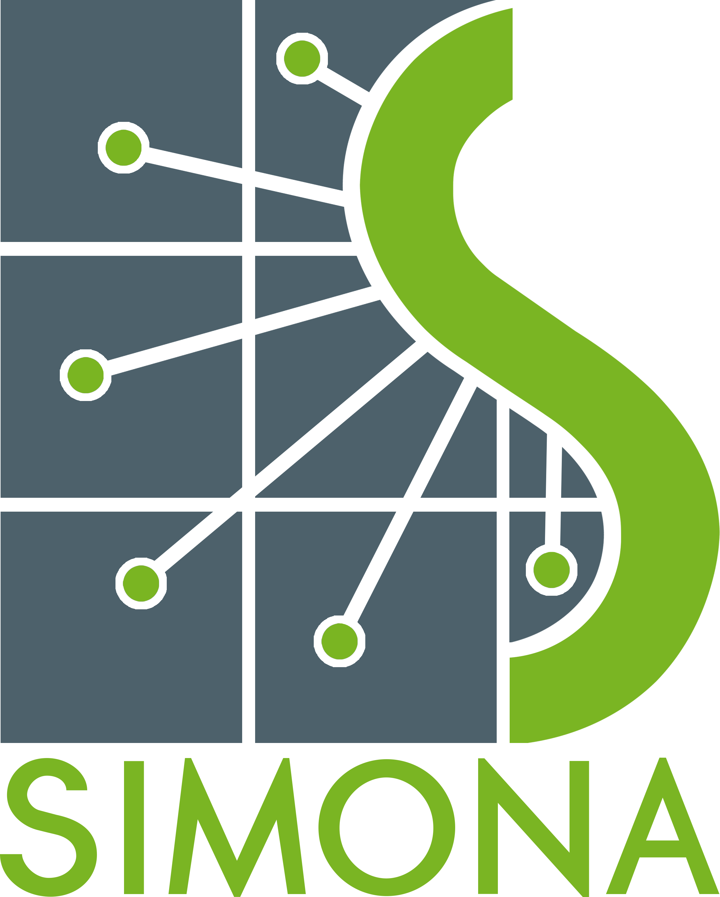

Welcome to simona docs
======================

Welcome to the documentation of simona - an agent-based discrete-event power system simulation model developed at the
Institute of Energy Systems, Energy Efficiency and Energy Economics at TU Dortmund University, Germany.

.. toctree::
   :maxdepth: 2

   about
   usersguide
   config/config
   Configuration
   models/models.md
   protocols

Indices and tables
==================

* :ref:`genindex`
* :ref:`modindex`
* :ref:`search`
