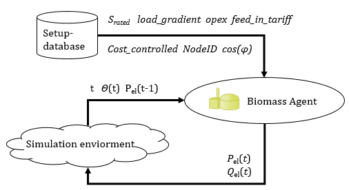
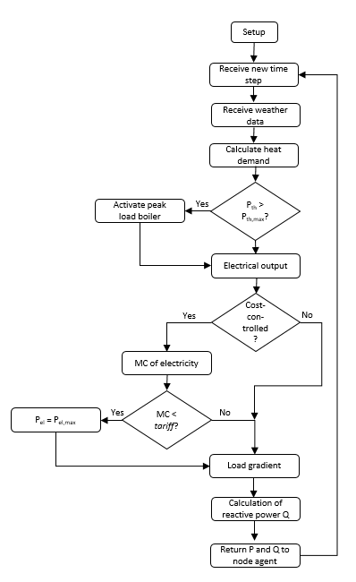
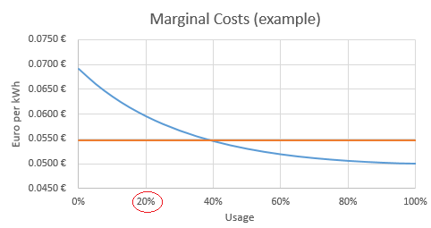

(bm_model)=
## Biomass Model

This page documents the functionality of the BM model available in SIMONA.

The BM model is part of the SIMONA Simulation framework and represented by an agent.

### Parameters

### Attributes, Units and Remarks

Please refer to {doc}`PowerSystemDataModel - BM Model <psdm:models/input/participant/bm>` for Attributes and Units used in this Model.

### Assumptions
The biomass is used in a cogeneration process. The thermal output is used for heating purposes and therefore weather-dependent.

### Agent Objectives
The main objective of the BM agent is to cover the heat demand of the connected consumers. Furthermore, it is possible to increase the output power if the revenues exceed the energy generation costs (Cost-controlled operating mode).

### Implemented Behaviour

#### Calculate Heat Demand
The heat demand is calculated in relation to the temperature using the results of a linear regression. Furthermore, correction factors, which take different heat demands on the weekend and outside the heating season into account are used.

$$
\begin{eqnarray*} P_{th}(T,t) = \begin{cases}
(-1.076 \cdot T \:\frac{MW}{°C} + 26.36 \:{MW}) \cdot k_1(t) \cdot k_2(t), & T<19.28{°C}\\5.62 \: {MW} \cdot k_1(t) \cdot k_2 (t), & T \ge 19.28 {°C}
\end{cases}\end{eqnarray*}
$$

With the factor $k_1(t)$ respecting the different load-demand on the weekend by multiplying demands of each hour with values between 0.95 and 1.02.

And $k_{2}(t)$:

$$
\begin{eqnarray*}k_2(t)=\begin{cases}
1.03, & \text{t inside heating season} \\
0.61 & \text{t outside heating season}
\end{cases}\end{eqnarray*}
$$

#### Usage and Peak Load Boiler

The calculated heat demand is based on data of 2010 and 2011 of a regional local heat supplier. During this period, the maximum heat demand was 43.14 MW with temperatures going down to -12.4°C. The usage is described by the relation of the heat-demand to the maximum observed heat demand. It is assumed, that above the maximum observed heat demand a peak load boiler will be activated, so the usage of the cogeneration process (which determines the electrical output) is restricted to 100 %.

$$
\begin{eqnarray*} usage = \begin{cases}
\frac{P_{th}}{43.14 {MW}}, & P_{th}<43.14{MW} \\
1 & P_{th}\ge 43.14{MW}
\end{cases}\end{eqnarray*}
$$

#### Electrical Output
The load-dependent efficiency is calculated by

$$
efficiency = 0.18 \cdot usage^3  -0.595 \cdot usage^2 +0.692 \cdot usage + 0.724 
$$

and used to determine the electrical output (based on the heat demand) by

$$ 
P_{el} = S_{rated} \cdot usage \cdot efficiency \cdot \cos(\phi) 
$$

#### Marginal Costs
If the plant is operating in cost controlled mode, the electrical output may be altered due to revenues, which exceed the marginal costs. As a result of the load-dependent efficiency, the marginal costs will rise at lower usages. Therefore, the agent calculates the average MC at the current usage and the MC at 100 % usage. In the example below, MC at 100 % usage is assumed to be 5 ct/kWh, which rises at lower output (blue line) based on

$$
OPEX_{current} = \frac{OPEX}{efficiency}
$$

For a given usage (example: 20 %), the average of the current OPEX and OPEX at full usage is calculated (orange line) and compared with the granted feed in tariff. If the feed in tariff exceeds the average costs, the usage will be set to 100 %.

#### Load Gradient
Owing to the inertia of the cogeneration process, the BM plant may not be able to change its output power to the calculated optimal value. In order to account for this, the change in power since the last time step (t-τ) is compared to the load gradient, which describes the maximum rate of change of the electrical power. The output power is set to:

$$
\begin{eqnarray*} P_{output}(t) = \begin{cases}
P_{output}(t-r) + \Delta P_{el,max}, & \Delta P_{el} < -\Delta P_{el,max} \\
P_{output}(t-r) - \Delta P_{el,max}, & \Delta P_{el} \ge -\Delta P_{el,max} \\
P_{el}, & \text{otherwise}
\end{cases}\end{eqnarray*}
$$

with

$$
\Delta P_{el,max}=S_{rated} \cdot \cos{\phi} \cdot \text{loadgradient} \cdot \tau
$$
