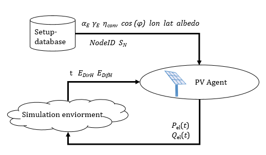

(pv_model)=

# Photovoltaic Model

This page documents the functionality of the PV model available in SIMONA.

The initial parts of the model are presented in the paper _Agent based approach to model photovoltaic feed-in in distribution network planning_ by {cite:cts}`Seack.2014`.
Since then several adaptions has been made that are documented as follows.

The PV Model is part of the SIMONA Simulation framework and represented by an agent.

## Parameters

## Attributes, Units and Remarks

Please refer to {doc}`PowerSystemDataModel - PV Model <psdm:models/input/participant/pv>` for Attributes and Units used in this Model.

## Implemented Behaviour

## Calculations

The energy produced by a photovoltaic (PV) unit in a specific time step is based on the diffuse and direct radiance provided by the used weather data.
The following steps are done to calculate (= estimate) the power feed in by the PV.

The model calculations are performed on the basis of _radiance_ (power per area, symbol $G$).
Some sources are primarily based on radiance {cite:p}`Myers.2017`.
Others are developing models using _radiation_ values (energy per area, symbols $I$ or $H$), which are often times referencing a fixed time frame, e.g. of one hour.
Conversions to radiance values can be easily made and can be used interchangeably ({cite:p}`Duffie.2013` p. 86, footnote).

_Irradiance_ and _irradiation_ describe power and energy arriving at a surface, while the terms _radiance_ and _radiation_ are used for general purposes ({cite:p}`Iqbal.1983` Ch. 2.6).

To calculate the overall feed in of the PV unit, the sum of the direct irradiance, diffuse irradiance and reflected irradiance is needed.
In the following, the formulas to calculate each of these radiances are presented and explained.
The sections end with the formula to calculate the corresponding power feed in.

**Caution:** if not stated otherwise, all angles are given in radian!

The surface azimuth angle $\alpha_{e}$ starts at negative values in the East and moves over 0° (South) towards positive values in the West ([Source](https://www.photovoltaik.org/wissen/azimutwinkel)).

### Declination Angle

The declination angle $\delta$ (in radian!) is the day angle that represents the position of the earth in relation to the sun.
To calculate this angle, we need to calculate the day angle $J$.
The day angle in radian is represented by:

$$
J = 2 \pi(\frac{n-1}{365})
$$

*with*\
**n** = number of the day in the year (e.g. 1 January = 1, 20 February = 51)

Based on $J$ the declination angle $\delta$ (in radian!) can be calculated as follows:

$$
\begin{eqnarray*}\delta = 0.006918 - 0.399912 \cdot \cos(J) + 0.070257 \cdot
\sin(J) \\ - 0.006758 \cdot \cos(2\cdot J) + 0.000907 \cdot \sin(2 \cdot J) \\ - 0.002697 \cdot \cos(3 \cdot J) + 0.00148 \cdot \sin(3 \cdot J)
\end{eqnarray*}
$$

**References:**

* {cite:cts}`Maleki.2017`
* {cite:cts}`Spencer.1971`

### Hour Angle

The hour angle is a conceptual description of the rotation of the earth around its polar axis.
It starts with a negative value in the morning, arrives at 0° at noon (solar time) and ends with a positive value in the evening.
The hour angle (in radian!) is calculated as follows

$$
\omega = ((12 - ST) \cdot 15) \cdot (\frac{\pi}{180})
$$

Since outside German literature the hour angle is defined as negative in the morning, we use the following adaption:

$$
\omega = ((ST - 12) \cdot 15) \cdot (\frac{\pi}{180})
$$

*with*\
**ST** = local solar time (standard time, in hours)

$$
ST = LMT + ET
$$

*with*\
**LMT** = local mean time (in minutes)\
**ET** = equation of time (in minutes)

$$
LMT = CET - 4 \cdot (15 - \lambda)
$$

*with*\
**CET** = central eastern time\
**λ** = longitude of the location of the PV panel

$$
\begin{eqnarray*}ET = 0.0066 + 7.3525 \cdot \cos(J + 1.4992378274631293) \\ +
9.9359 \cdot \cos(2 \cdot J + 1.9006635554218247) \\ + 0.3387 \cdot \cos(3 \cdot J + 1.8360863730980346)
\end{eqnarray*}
$$

*with*\
**J** = day angle (in radian!)

**Note:** The used formulas are based on *\"DIN 5034-2: Tageslicht in Innenräumen, Grundlagen.\"* and therefore valid especially for Germany and Europe.
For international calculations a more general formulation that can be found in {cite:p}`Maleki.2017` might be used.

**References:**

* {cite:cts}`Watter.2013`
* {cite:cts}`Maleki.2017`
* {cite:cts}`Wang.2019`

### Sunrise Angle

The hour angles at sunrise and sunset are very useful quantities to know.
These two values have the same absolute value, however the sunset angle ($\omega_{SS}$) is positive and the sunrise angle ($\omega_{SR}$) is negative.
Both can be calculated from:

$$
\omega_{SS}=\cos^{-1}(-\tan (\phi) \cdot \tan (\delta))
$$

$$
\omega_{SR}=-\omega_{SS}
$$

*with*\
**$\delta$** = the declination angle\
**$\phi$** = observer's latitude

**References:**

* {cite:cts}`Maleki.2017`
* {cite:cts}`Duffie.2013` p. 17 (formula 1.6.10)

### Solar Altitude Angle

Represents the angle between the horizontal and the line to the sun, that is, the complement of the zenith angle.

$$
\sin(\alpha_{s}) = \sin (\phi) \cdot \sin (\delta) + \cos (\delta) \cdot \cos (\omega) \cdot \cos (\phi)
$$

*with*\
**$\delta$** = the declination angle\
**$\phi$** = observer's latitude\
**$\omega$**= hour angle

**References:**

* {cite:cts}`Maleki.2017` p. 5
* {cite:cts}`Duffie.2013` p. 15 (formula 1.6.5) with $\sin (\alpha_s) = \cos (\theta_z)$

### Zenith Angle

Represents the angle between the vertical and the line to the sun, that is, the angle of incidence of beam radiance on a horizontal surface.

$$
\theta_{z} = (\frac{\pi}{2}) - \alpha_{s}
$$

*with*\
**$\alpha_s$** = solar altitude angle

**References:**
See Solar Altitude Angle

### Incidence Angle

The angle of incidence is the angle between the Sun\'s rays and the PV panel.
It can be calculated as follows:

$$
\begin{eqnarray*}
\theta_{g} = \arccos(\sin(\delta) \cdot \sin(\phi) \cdot
\cos(\gamma_{e}) \\ - \sin(\delta) \cdot \cos(\phi) \cdot
\sin(\gamma_{e}) \cdot \cos(\alpha_{e}) \\ +
\cos(\delta) \cdot \cos(\phi) \cdot \cos(\gamma_{e}) \cdot
\cos(\omega) \\ + \cos(\delta) \cdot \sin(\phi) \cdot \sin(\gamma_{e})
\cdot \cos(\alpha_{e}) \cdot \cos(\omega) \\ +
\cos(\delta) \cdot \sin(\gamma_{e}) \cdot \sin(\alpha_{e}) \cdot
\sin(\omega))
\end{eqnarray*}
$$

*with*\
**$\alpha_e$** = surface azimuth angle\
**$\gamma_e$** = slope angle of the surface\
**$\delta$** = the declination angle\
**$\phi$** = observer's latitude\
**$\omega$** = hour angle

**References:**

* {cite:cts}`Quaschning.2013`
* {cite:cts}`Maleki.2017` p. 18

### Air Mass

Calculating the air mass ratio by dividing the radius of the earth with approx.
effective height of the atmosphere (each in kilometer)

$$
\mathrm{airmassratio} = (\frac{6371 km}{9 km}) = 707.8\overline{8}
$$

$$
\mathrm{airmass} = \sqrt{(707.8\overline{8} \cdot \cos({\theta_z}))^2 +2 \cdot 707.8\overline{8} +1)} - 707.8\overline{8} \cdot \cos{(\theta_z)})
$$

**References:**

* {cite:cts}`Schoenberg.1929`
* {cite:cts}`WikiAirMass`

### Extraterrestrial Radiance

The extraterrestrial radiance $G_0$ is calculated by multiplying the eccentricity correction factor.

$$
\begin{eqnarray*}
e = 1.00011 + 0.034221 \cdot \cos(J) + 0.001280 \cdot \sin(J) \\ + 0.000719 \cdot \cos(2 \cdot J) + 0.000077 \cdot \sin(2 \cdot J)
\end{eqnarray*}
$$

with the solar constant

$$
G_{SC} = 1367 {\frac{W}{m^2}}
$$

*with*\
**J** = day angle

**References:**

* {cite:cts}`Zheng.2017` p. 53, formula 2.3b
* {cite:cts}`Iqbal.1983`
* {cite:cts}`Spencer.1971`
* {cite:cts}`Duffie.2013` (the fifth ed. seems to have a typo in formula (1.4.1b): factor $0.000719$ is missing a zero)

### Beam Irradiance on Sloped Surface

For our use case, $\omega_{2}$ is normally set to the hour angle one hour after $\omega_{1}$.
Within one hour distance to sunrise/sunset, we adjust $\omega_{1}$ and $\omega_{2}$ accordingly:

$$
\begin{eqnarray*}
(\omega_{1}, \omega_{2}) = \begin{cases}
(\omega_{SR}, \omega_{SR} + \Delta\omega), & \text{for}  (\omega_{SR}-\frac{\Delta \omega}{2}) < \omega < \omega_{SR} \\ (\omega, \omega+ \Delta\omega), & \text{for } \omega_{SR} \le \omega \le (\omega_{SS}- \Delta\omega) \\ (\omega_{SS}-\Delta\omega,\omega_{SS}), & \text{for }(\omega_{SR}-\Delta\omega) < \omega < (\omega_{SS}-\frac{\Delta\omega}{2})
\end{cases}
\end{eqnarray*}
$$

Additionally, the condition $\theta_{g} < 90°$ must be met (the sun must not be behind the surface).

*with*\
**$\omega$** = hour angle\
**$\omega_{SS}$** = hour angle $\omega$ at sunset\
**$\omega_{SR}$** = hour angle $\omega$ at sunrise\
**$\Delta\omega$** = $15^\circ \cdot (\frac {\pi}{180^\circ})$ (one hour worth of $\omega$)

From here on, formulas from given reference below are used:

$$
\begin{eqnarray*}
a = (\sin(\delta) \cdot \sin(\phi) \cdot \cos(\gamma_{e}) - 
\sin(\delta) \cdot \cos(\phi) \cdot \sin(\gamma_{e}) \cdot
\cos(\alpha_{e})) \cdot (\omega_{2} - \omega_{1}) \\ + (\cos(\delta) \cdot \cos(\phi) \cdot \cos(\gamma_{e}) +
\cos(\delta) \cdot \sin(\phi) \cdot \sin(\gamma_{e}) \cdot
\cos(\alpha_{e})) \cdot (\sin(\omega_{2}) \\ -
\sin(\omega_{1}))  - (\cos(\delta) \cdot \sin(\gamma_{e}) \cdot \sin(\alpha_{e})) \cdot (\cos(\omega_{2}) - \cos(\omega_{1}))
\end{eqnarray*}
$$

$$
b = (\cos(\phi) \cdot \cos(\delta)) \cdot (\sin(\omega_{2}) - \sin(\omega_{1})) + (\sin(\phi) \cdot \sin(\delta)) \cdot (\omega_{2} - \omega_{1})
$$

$$
G_{\mathrm{beam},S} = G_{\mathrm{beam},H} \cdot \frac{a}{b}
$$

*with*\
**$\delta$** = the declination angle\
**$\phi$** = observer's latitude\
**$\gamma_{e}$** = slope angle of the surface\
**$\omega_1$** = hour angle $\omega$\
**$\omega_2$** = hour angle $\omega$ + 1 hour\
**$\alpha_e$** = surface azimuth angle\
**$G_{\mathrm{beam},H}$** = beam irradiance (horizontal surface)

**Please note:**
1. $\frac{1}{180}\pi$ is omitted from these formulas, as we are already working with data in *radians*.
2. In contrast to the primary source {cite:p}`Duffie.2013`, radiance values instead of radiation values are used here, as described above.

**Reference:**

* {cite:cts}`Duffie.2013` p. 88

### Diffuse Irradiance on Sloped Surface

The diffuse irradiance is computed using the Perez model, which divides the irradiance into three parts.
First, there is an intensified irradiance from the direct vicinity of the sun.
Furthermore, there is Rayleigh scattering, backscatter (which lead to increased in intensity on the horizon) and isotropic irradiance considered.

A cloud index is defined by

$$
\epsilon = \frac{\frac{G_{\mathrm{dif},H} + G_{\mathrm{beam},N}}{G_{\mathrm{dif},H}} + 5.535 \cdot 10^{-6} \cdot \theta_{z}^3}{1 + 5.535 \cdot 10^{-6} \cdot \theta_{z}^3}
$$

with angle $\theta_z$ values in **degrees** ({cite:p}`Duffie.2013` p. 94) and $G_{\mathrm{beam},N} = \frac{G_{\mathrm{beam},H}}{\cos (\theta_z)}$ ({cite:p}`Duffie.2013` p. 95).

Calculating a brightness index

$$
\Delta = m \cdot \frac{G_{\mathrm{dif},H}}{G_{0}}
$$

**Perez Fij coefficients (Myers 2017):**

$\epsilon$ is sorted into one of eight bins according to its value:

| $\epsilon$ low | $\epsilon$ high | Bin number$x$ |
| ---------------- | ----------------- | --------------- |
| 1              | 1.065           | 1             |
| 1.065          | 1.230           | 2             |
| 1.230          | 1.500           | 3             |
| 1.500          | 1.950           | 4             |
| 1.950          | 2.800           | 5             |
| 2.800          | 4.500           | 6             |
| 4.500          | 6.200           | 7             |
| 6.200          | $\infty$        | 8             |

In order to calculate indexes representing the horizon brightness and the brightness in the vicinity of the sun, the following factors are computed.

$$
F_{11}(x) = -0.0161 \cdot x^3 + 0.1840 \cdot x^2 - 0.3806 \cdot x + 0.2324
$$

$$
F_{12}(x) = 0.0134 \cdot x^4 - 0.1938 \cdot x^3 + 0.8410 \cdot x^2 - 1.4018 \cdot x + 1.3579
$$

$$
F_{13}(x) = 0.0032 \cdot x^3 - 0.028 \cdot x^2 - 0.0056
\cdot x - 0.0385
$$

$$
F_{21}(x) = -0.0048 \cdot x^3 + 0.0536 \cdot x^2 - 0.1049
\cdot x + 0.0034
$$

$$
F_{22}(x) = 0.0012 \cdot x^3 - 0.0067 \cdot x^2 + 0.0091
\cdot x - 0.0269
$$

$$
F_{23}(x) = 0.0052 \cdot x^3 - 0.0971 \cdot x^2 + 0.2856
\cdot x - 0.1389
$$

Horizon brightness index:

$$
F_{1} = F_{11}(x) + F_{12}(x) \cdot \Delta + F_{13}(x)
\cdot \theta_{z}
$$

Sun ambient brightness index:

$$
F_{2} = F_{21}(x) + F_{22}(x) \cdot \Delta + F_{23}(x)
\cdot \theta_{z}
$$

Using the factors

$$
a = max(0, \cos(\theta_{g}))
$$

and

$$
b = max(0.087, \sin(\alpha_{s}))
$$

the diffuse irradiance can be calculated:

$$
G_{\mathrm{dif},S} = G_{\mathrm{dif},H} \cdot (\frac{1}{2} \cdot (1 +
cos(\gamma_{e})) \cdot (1- F_{1}) + \frac{a}{b} \cdot F_{1} +
F_{2} \cdot \sin(\gamma_{e}))
$$

*with*\
**$\theta_{z}$** = zenith angle\
**$\theta_{g}$** = angle of incidence\
**$\alpha_{s}$** = solar altitude angle\
**$\gamma_{e}$** = slope angle of the surface\
**$G_{0}$** = extraterrestrial radiance\
**$m$** = air mass\
**$G_{\mathrm{beam},H}$** = beam irradiance (horizontal surface)\
**$G_{\mathrm{beam},N}$** = beam irradiance (normal incidence, thus irradiance on a plane normal to the direction of the beam)\
**$G_{\mathrm{dif},H}$** = diffuse irradiance (horizontal surface)

**Please note:** In contrast to the primary source {cite:p}`Duffie.2013`, radiance values instead of radiation values are used here, as described above.

**References:**

* {cite:cts}`Perez.1987`
* {cite:cts}`Perez.1990`
* {cite:cts}`Myers.2017` p. 96f
* {cite:cts}`Duffie.2013` p. 95f

### Reflected Irradiance on Sloped Surface

$$
G_{\mathrm{ref},S} = G_{\mathrm{Ges},H} \cdot \frac{\rho}{2} \cdot (1-
\cos(\gamma_{e}))
$$

*with*\
**$G_{\mathrm{Ges},H}$** = total horizontal irradiance ($G_{\mathrm{beam},H} + G_{\mathrm{dif},H})$\
**$\gamma_e$** = slope angle of the surface\
**$\rho$** = albedo

**Reference:**

* {cite:cts}`Maleki.2017` p. 19

### Output

Received energy is calculated as the sum of all three types of irradiance.

$$
G_{\mathrm{total}} = G_{\mathrm{beam},S} + G_{\mathrm{dif},S} + G_{\mathrm{ref},S}
$$

*with*\
**$G_{\mathrm{beam},S}$** = Beam irradiance\
**$G_{\mathrm{dif},S}$** = Diffuse irradiance\
**$G_{\mathrm{ref},S}$** = Reflected irradiance

A generator correction factor (depending on month surface slope $\gamma_{e}$) and a temperature correction factor (depending on month) multiplied on top.

It is checked whether proposed output exceeds maximum ($p_{max}$), in which case a warning is logged.
If output falls below activation threshold, it is set to 0.
