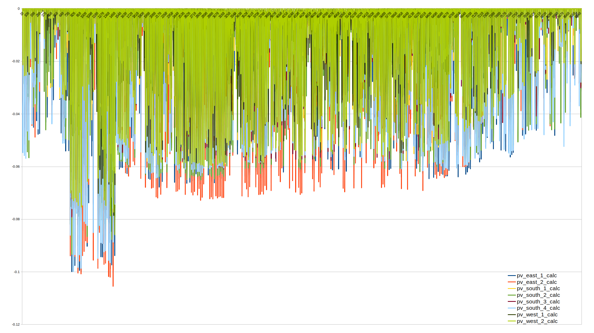
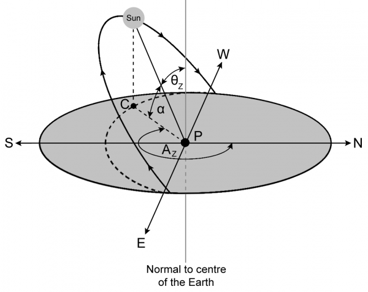

# PV Model

This page documents the functionality of the PV model available in SIMONA.

The initial parts of the model are presented in the paper [Agent based approach to model photovoltaic feed-in in distribution network planning](https://ieeexplore.ieee.org/abstract/document/7038345). Since then several adaptions has been made that are documented as follows.

The PV Model is part of the SIMONA Simulation framework and represented by an agent.

## Parameters

```{mermaid}
graph
    A[(Setup-database)] 
    B([PV Agent])
    C{{Simulation environment}}

    A -- "α<SUB>E</SUB> γ<SUB>E</SUB> <br> η<SUB>conv</SUB> cos(φ)<br> lon lat <br>  albedo<br> NodeID S<SUB>N</SUB><br> " --> B
    B -- "P<SUB>el</SUB>(t)<br> Q<SUB>el</SUB>(t)"--> C
    C -- "t <br> E<SUB>Dir, H</SUB> <br> E<SUB>Dif,H</SUB>" --> B
```

## Implemented Behaviour

```{mermaid}
flowchart
    A[Setup] 
    --> B[Receive new time step] 
    --> C[Receive weather data]
    --> D[Calculation of sun position]
    --> E[Calculation of direct radiation]
    --> F[Calculation of diffuse radiation]
    --> G[Calculation of reflected radiation]
    --> H[Estimation of correction factors]
    --> I[Calculation of output power P]
    --> J[Calculation of reactive power Q]
    --> K[Return p and Q to node agent] --> B
```

## Output visualization



## Calculations


The energy produced by a photovoltaic (pv) unit in a specific time step is based on the diffuse and direct radiation provided by the used weather data. The following steps are done to calculate (= estimate) the power feed by the pv.

To calculate the overall feed in of the pv unit, the sum of the direct radiation, diffuse radiation and reflected radiation is needed. In the following, the formulas to calculate each of these radiations are presented and explained. The sections end with the formula to calculate the corresponding power feed in.

**Caution:** all angles are given in radian!

The azimuth angle $\alpha_E$ starts at negative values in the East and moves over 0° (South) towards positive values in the West. [Source](https://www.photovoltaik.org/wissen/azimutwinkel)

### Declination Angle


The declination angle $\delta$ (in radian!) is the day angle that represents the position of the earth in relation to the sun. To calculate this angle, we need to calculate the day angle $J$. The day angle in radian is represented by:

$$
J = 2 \pi(\frac{n-1}{365})

$$

*with*   **n** = number of the day in the year (e.g. 1 January = 1, 20 February = 51)

Based on $J$ the declination angle $\delta$ (in radian!) can be calculated as follows:\

$$
\delta = 0.006918 - 0.399912 \cdot cos(J) + 0.070257 \cdot
sin(J) \\ - 0.006758 \cdot cos(2\cdot J) + 0.000907 \cdot sin(2 \cdot J) \\ - 0.002697 \cdot cos(3 \cdot J) + 0.00148 \cdot sin(3 \cdot J)

$$

**References:**

- [Maleki, S.A., Hizam, H., & Gomes, C. (2017). Estimation of Hourly, Daily and Monthly Global Solar Radiation on Inclined Surfaces: Models Re-Visited.](https://res.mdpi.com/d_attachment/energies/energies-10-00134/article_deploy/energies-10-00134-v2.pdf) p. 2
  Original reference of declination angle is: [Spencer, J.W. Fourier series representation of the position of the sun. Appl. Opt. 1971, 10, 2569--2571](https://www.mail-archive.com/sundial@uni-koeln.de/msg01050.html)

### Hour Angle

The hour angle is a conceptual description of the rotation of the earth around its polar axis. It starts with a negative value in the morning, arrives at 0° at noon (solar time) and ends with a positive value in the evening. The hour angle (in radian!) is calculated as follows


$$
\omega = ((12 - ST) \cdot 15) \cdot (\frac{\pi}{180})

$$

Since outside German literature the hour angle is defined as negative in the morning, we use the following adaption:

$$
\omega = ((ST - 12) \cdot 15) \cdot (\frac{\pi}{180})

$$

*with*   **ST** = local solar time (standard time, in hours)

$$
ST = LMT + ET

$$

*with*
~ **LMT** = local mean time (in minutes)
**ET** = equation of time (in minutes)

$$
LMT = CET - 4 \cdot (15 - \lambda)

$$

*with*
~ **CET** = central eastern time
**λ** = longitude of the location of the PV panel

$$
ET = 0.0066 + 7.3525 \cdot cos(J + 1.4992378274631293) \\ +
9.9359 \cdot cos(2 \cdot J + 1.9006635554218247) \\ + 0.3387 \cdot cos(3 \cdot J + 1.8360863730980346)

$$

*with* **J** = day angle (in radian!)

**Note:** The used formulas are based on *\"DIN 5034-2: Tageslicht in Innenräumen, Grundlagen.\"* and therefore valid especially for Germany and Europe. For international calculations a more general formulation that can be found in [Maleki, S.A., Hizam, H., & Gomes, C. (2017). Estimation of Hourly, Daily and Monthly Global Solar Radiation on Inclined Surfaces: Models Re-Visited.](https://res.mdpi.com/d_attachment/energies/energies-10-00134/article_deploy/energies-10-00134-v2.pdf) might be used.\

**References:**

- Watter, Holger. (2013). Regenerative Energiesysteme: Grundlagen, Systemtechnik und Analysen ausgeführter Beispiele nachhaltiger Energiesysteme. 10.1007/978-3-658-23488-1.
- Regarding pos/neg direction of $\omega$: [Science Direct: Solar Hour Angle](https://www.sciencedirect.com/topics/engineering/solar-hour-angle). Primary source: [Wang, Zhifeng. (2019). Design of Solar Thermal Power Plants.](https://www.sciencedirect.com/science/article/pii/B978012815613100002X)
-

### Sunrise Angle

The hour angles at sunrise and sunset are very useful quantities to know. These two values have the same absolute value, however the sunrise angle ($\omega_{SR}$) is positive and the sunset angle ($\omega_{S}$) is negative. Both can be calculated from:

$$
\omega_{SR}=\cos^{-1}(-\tan (\phi) \cdot \tan (\delta)

$$

$$
\omega_{SS}=-\omega_{SR}

$$

*with*   $\delta$ = the declination angle

**References:**

- [Maleki, S.A., Hizam, H., & Gomes, C. (2017). Estimation of Hourly, Daily and Monthly Global Solar Radiation on Inclined Surfaces: Models Re-Visited.](https://res.mdpi.com/d_attachment/energies/energies-10-00134/article_deploy/energies-10-00134-v2.pdf) p. 20
- [The Sun As A Source Of Energy Part 3: Calculating Solar Angles](https://www.itacanet.org/the-sun-as-a-source-of-energy/part-3-calculating-solar-angles/)

### Solar Altitude Angle

Represents the angle between the horizontal and the line to the sun, that is, the complement of the zenith angle.

$$
sin(\alpha_{s}) = sin (\phi) \cdot sin (\delta) + cos (\delta) \cdot cos (\omega) \cdot cos (\phi)

$$

*with*
~ $\delta$ = the declination angle
$\phi$ = observer's latitude
$\omega$= hour angle

**References:**

- [Maleki, S.A., Hizam, H., & Gomes, C. (2017). Estimation of Hourly, Daily and Monthly Global Solar Radiation on Inclined Surfaces: Models Re-Visited.](https://res.mdpi.com/d_attachment/energies/energies-10-00134/article_deploy/energies-10-00134-v2.pdf) p. 5  (Zenith angle $\theta_z$ is an adjacent angle of $\alpha_s$)
- [The Sun As A Source Of Energy Part 3: Calculating Solar Angles](https://www.itacanet.org/the-sun-as-a-source-of-energy/part-3-calculating-solar-angles/)




### Zenith Angle

Represents the angle between the vertical and the line to the sun, that is, the angle of incidence of beam radiation on a horizontal surface.

$$
\theta_{z} = (\frac{\pi}{2}) - \alpha_{s}

$$

*with*   **$\alpha_s$** = solar altitude angle

**References:**
See Solar Altitude Angle

### Incidence Angle

The angle of incidence is the angle between the Sun\'s rays and the PV panel. It can be calculated as follows:

$$
\theta_{g} = \arccos(\sin(\delta) \cdot \sin(\phi) \cdot
\cos(\gamma_{e}) \\ - \sin(\delta) \cdot \cos(\phi) \cdot
\sin(\gamma_{e}) \cdot \cos(\alpha_{e}) \\ +
\cos(\delta) \cdot \cos(\phi) \cdot \cos(\gamma_{e}) \cdot
\cos(\omega) \\ + \cos(\delta) \cdot \sin(\phi) \cdot \sin(\gamma_{e})
\cdot \cos(\alpha_{e}) \cdot \cos(\omega) \\ +
cos(\delta) \cdot sin(\gamma_{e}) \cdot sin(\alpha_{e}) \cdot
sin(\omega))

$$

*with*
~ $\alpha_e$ = sun azimuth
~ $\alpha_s$ = solar altitude angle
~ $\gamma_e$ = slope angle of the surface
~ $\delta$ = the declination angle
~ $\phi$ = observer's latitude
~ $\omega$ = hour angle

**References:**\

- Quaschning, Volker. (2013). Regenerative Energiesysteme. [Maleki, S.A., Hizam, H., & Gomes, C. (2017). Estimation of Hourly, Daily and Monthly Global Solar Radiation on Inclined Surfaces: Models Re-Visited.](https://res.mdpi.com/d_attachment/energies/energies-10-00134/article_deploy/energies-10-00134-v2.pdf) p. 18

### Air Mass

Calculating the air mass ratio by dividing the radius of the earth with approx. effective height of the atmosphere (each in kilometer)

$$
airmassratio = (\frac{6371 km}{9 km}) = 707.8\overline{8}

$$

$$
airmass = \sqrt{(707.8\overline{8} \cdot \cos({\theta_z}))^2 +2 \cdot 707.8\overline{8} +1)} - 707.8\overline{8} \cdot \cos{(\theta_z)})

$$

**References:**\

- [Schoenberg, E. (1929). Theoretische Photometrie, g) Über die Extinktion des Lichtes in der Erdatmosphäre. In Handbuch der Astrophysik. Band II, erste Hälfte. Berlin: Springer.](https://link.springer.com/chapter/10.1007/3-540-30669-2_3)
  [Wikipedia: Air Mass](https://en.wikipedia.org/wiki/Air_mass_(solar_energy)#Calculation)

### Extraterrestrial Radiation

The extraterrestrial radiation I~0~ is calculated by multiplying the eccentricity correction factor

$$
e = 1.00011 + 0.034221 \cdot \cos(J) + 0.001280 \cdot \sin(J) \\ + 0.000719 \cdot \cos(2 \cdot J) + 0.000077 \cdot \sin(2 \cdot J)

$$

with the solar constant

$$
G_{SC} = 1367 {\frac{W}{m^2}}

$$

*with*   **J** = day angle

\*\*References:\*\*

- Zheng, H. (2017). Solar Energy Utilization and Its Collection Devices. p. 53, formula 2.3b\
- Iqbal, M. (1983). An introduction to solar radiation.

### Beam Radiation on Sloped Surface

For our use case, $\omega_2$ is normally set to the hour angle one hour after $\omega_1$. Within one hour distance to sunrise/sunset, we adjust $\omega_1$ and $\omega_2$ accordingly:

$$
(\omega_1, \omega_2) = \begin{cases}
\omega_{SR}, \omega_{SR} + \Delta\omega), & \text{for } (\omega_{SR}-\frac{\Delta \omega}{2}) < \omega < \omega_{SR} \\ (\omega, \omega+ \Delta\omega), & \text{for } \omega_{SR} \le \omega \le (\omega_{SS}- \Delta\omega) \\ (\omega_{SS}-\Delta\omega,\omega_{SS}), & \text{for }(\omega_{SR}-\Delta\omega) < \omega < (\omega_{SS}-\frac{\Delta\omega}{2})
\end{cases}

$$

*with*
~ $\omega$ = hour angle
~ $\omega_{SS}$ = hour angle $\omega$ at sunset
~ $\omega_{SR}$ = hour angle $\omega$ at sunrise
~ $\Delta\omega$ = $15 \circ \cdot (\frac {\pi}{180^\circ})$
(one hour worth of $\omega$)

From here on, formulas from given reference below are used:

$$
a = (\sin(\delta) \cdot \sin(\phi) \cdot \cos(\gamma_{e})
\sin(\delta) \cdot \cos(\phi) \cdot \sin(\gamma_{e}) \cdot
\cos(\alpha_{e})) \cdot (\omega_{2} - \omega_{1}) \\ + (\cos(\delta) \cdot \cos(\phi) \cdot \cos(\gamma_{e}) +
\cos(\delta) \cdot \sin(\phi) \cdot \sin(\gamma\_{e}) \cdot
\cos(\alpha_{e})) \cdot (\sin(\omega_{2}) \\ -
\sin(\omega_{1}))  - (\cos(\delta) \cdot \sin(\gamma_{e}) \cdot \sin(\alpha_{e})) \cdot (\cos(\omega_{2}) - \cos(\omega_{1}))

$$

$$
b = (\cos(\phi) \cdot \cos(\delta)) \cdot (\sin(\omega_{2}) - \sin(\omega_{1})) + (\sin(\phi) \cdot \sin(\delta)) \cdot (\omega_{2} - \omega_{1})

$$

$$
E_{dir,S} = E_{dir,H} \cdot \frac{a}{b}

$$

**Please note:** $\frac{1}{180}\pi$ is omitted from these formulas, as we are already working with data in *radians*.

*with*
~ $\delta$ = the declination angle
~ $\phi$ = observer's latitude
~ $\gamma$ = slope angle of the surface
~ $\omega_1$ = hour angle $\omega$
~ $\omega_2$ = hour angle $\omega$ + 1 hour
~ $\alpha_e$ = sun azimuth
~ $E_{dir,H}$ = beam radiation (horizontal surface)

\*\* Reference: \*\*\

- [Duffie, J.A., & Beckman, W.A. (2013). Solar Engineering of Thermal Processes: Duffie/Solar Engineering 4e.](https://www.sku.ac.ir/Datafiles/BookLibrary/45/John%20A.%20Duffie,%20William%20A.%20Beckman(auth.)-Solar%20Engineering%20of%20Thermal%20Processes,%20Fourth%20Edition%20(2013).pdf) p. 88

### Diffuse Radiation on Sloped Surface

The diffuse radiation is computed using the Perez model, which divides the radiation in three parts. First, there is an intensified radiation from the direct vicinity of the sun. Furthermore, there is Rayleigh scattering, backscatter (which lead to increased in intensity on the horizon) and isotropic radiation considered.

A cloud index is defined by

$$
\epsilon = \frac{\frac{E_{dif,H} + E_{dir,H}}{E_{dif,H}} + 5.535 \cdot 10^{-6} \cdot \theta_{z}^3}{1 + 5.535 \cdot 10^{-6} \cdot \theta_{z}^3}

$$

Calculating a brightness index

$$
\Delta = m \cdot \frac{E_{dif,H}}{I_{0}}

$$

**Perez Fij coefficients (Myers 2017):**

$$
\epsilon$$ is sorted into one of eight bins according to its value:


| $\epsilon$ low | $\epsilon$ high | Bin number $x$ |
|----------------|-----------------|----------------|
| 1              | 1.065           | 1              |
| 1.065          | 1.230           | 2              |
| 1.230          | 1.500           | 3              |
| 1.500          | 1.950           | 4              |
| 1.950          | 2.800           | 5              |
| 2.800          | 4.500           | 6              |
| 4.500          | 6.200           | 7              |
| 6.200          | $\infty$        | 8              |

In order to calculate indexes representing the horizon brightness and the brightness in the vicinity of the sun, the following factors are computed.

$$ F_{11}(x) = -0.0161 \cdot x^3 + 0.1840 \cdot x^2 - 0.3806
\cdot x + 0.2324

$$

$$
F_{12}(x) = 0.0134 \cdot x^4 - 0.1938 \cdot x^3 + 0.8410
\cdot x^2 - 1.4018 \cdot x + 1.3579

$$

$$
F_{13}(x) = 0.0032 \cdot x^3 - 0.028 \cdot x^2 - 0.0056
\cdot x - 0.0385

$$

$$
F_{21}(x) = -0.0048 \cdot x^3 + 0.0536 \cdot x^2 - 0.1049
\cdot x + 0.0034

$$

$$
F_{22}(x) = 0.0012 \cdot x^3 - 0.0067 \cdot x^2 + 0.0091
\cdot x - 0.0269

$$

$$
F_{23}(x) = 0.0052 \cdot x^3 - 0.0971 \cdot x^2 + 0.2856
\cdot x - 0.1389

$$

Horizon brightness index:

$$
F_{1} = F_{11}(x) + F_{12}(x) \cdot \Delta + F_{13}(x)
\cdot \theta_{z}

$$

Sun ambient brightness index:

$$
F_{2} = F_{21}(x) + F_{22}(x) \cdot \Delta + F_{23}(x)
\cdot \theta_{z}

$$

Using the factors

$$
a = max(0, \cos(\theta_{g}))

$$

and

$$
b = max(0.087, \sin(\alpha_{s}))

$$

the diffuse radiation can be calculated:

$$
E_{dif,S} = E_{dif,H} \cdot (\frac{1}{2} \cdot (1 +
cos(\gamma_{e})) \cdot (1- F_{1}) + \frac{a}{b} \cdot F_{1} +
F_{2} \cdot \sin(\gamma_{e}))

$$

*with*
~ $\theta_z$ = zenith angle
~ $\theta_g$ = angle of incidence
~ $\alpha_s$ = solar altitude angle
~ $\alpha_z$ = sun azimuth
~ $\gamma_e$ = slope angle of the surface
~ $I_0$ = Extraterrestrial Radiation
~ $m$ = air mass
~ $E_{dir,H}$ = direct radiation (horizontal surface)
~ $E_{dif,H}$ = diffuse radiation (horizontal surface)

**References:**

- [Perez, R.L., Seals, R., Ineichen, P., Stewart, R., & Menicucci, D.F. (1987). A NEW SIMPLIFIED VERSION OF THE PEREZ DIFFUSE IRRADIANCE MODEL FOR TILTED SURFACES.](http://www.physics.arizona.edu/~cronin/Solar/References/Shade%20effects/sdarticle%20(24).pdf)
- [Perez, R., Ineichen, P., Seals, R., Michalsky, J.J., & Stewart, R. (1990). Modeling daylight availability and irradiance components from direct and global irradiance.](http://www.cuepe.ch/html/biblio/pdf/perez-ineichen%201990%20-%20modelling%20daylight%20(se).pdf)
- Estimation of F-values: [Myers, D.R. (2017). Solar Radiation : Practical Modeling for Renewable Energy Applications.](https://www.semanticscholar.org/paper/Solar-Radiation-%3A-Practical-Modeling-for-Renewable-Myers/dc5f81a73058a6d96e697d562e51bbd7a83f0e85) p. 96f

### Reflected Radiation on Sloped Surface

$$
E_{ref,S} = E_{Ges,H} \cdot \frac{\rho}{2} \cdot (1-
\cos(\gamma_{e}))

$$

*with*
~ $E_{Ges,H}$ = total horizontal radiation ($E_{dir,H} + E_{dif,H})$
$\gamma_e$ = slope angle of the surface
$\rho$ = albedo

**Reference:**\

- [Maleki, S.A., Hizam, H., & Gomes, C. (2017). Estimation of Hourly, Daily and Monthly Global Solar Radiation on Inclined Surfaces: Models Re-Visited.](https://res.mdpi.com/d_attachment/energies/energies-10-00134/article_deploy/energies-10-00134-v2.pdf) p. 19

### Output

Received energy is calculated as the sum of all three types of
irradiation.

$$
E_{total} = E_{dir,S} + E_{dif,S} + E_{ref,S}

$$

*with*
~$E_{dir,S}$ = Beam radiation
~$E_{dif,S}$ = Diffuse radiation
~$E_{ref,S}$ = Reflected radiation

A generator correction factor (depending on month surface slope $\gamma_e$) and a temperature correction factor (depending on month) multiplied on top.

It is checked whether proposed output exceeds maximum ($p_{max}$), in which case a warning is logged. If output falls below activation threshold, it is set to 0.
