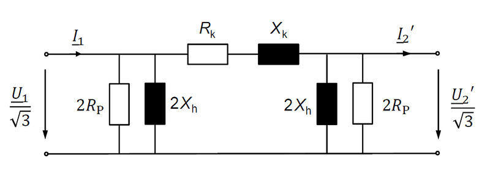

(two_winding_transformer_model)=
# Two winding transformer

## Attributes, Units and Remarks

Input and Result Attributes and Units are defined at PowerSystemDataModel. Please refer to:

- Input: {doc}`PowerSystemDataModel - Two Winding Transformer Model <psdm:models/input/grid/transformer2w>`
- Result: {doc}`PowerSystemDataModel - Two Winding Transformer Model <psdm:models/result/grid/transformer2w>`

**Calculation of basic equivalent circuit elements**

... based on derived values. **All values are given with regard to the high voltage side.**

1. Reference Impedance: $Z_{Ref}=\frac{V^{2}_{Ref}}{S_{Ref}},Z_{Ref}=\Omega$ based on externally given reference voltage $V_{Ref}$ and reference apparent power $S_{Ref}$
2. Reference Impedance regarding the transformer's reference system: $Z_{Ref,Transf} = \frac{V^{2}_{HV}}{S_{Rated}}, [Z_{Ref,Transf}] = \Omega$
3. Reference Current:$I_{Ref,Transf} = \frac{S_Ref,Transf}{\sqrt{3} \cdot V_{HV}}, [I_{Ref,Tranf}] = A$
4. Short circuit impedance: $Z_{SC} = v_{SC} \cdot Z_{Ref,Transf}, [Z_{SC}] = \Omega$ with $[v_{SC}] = \%$
5. Short circuit resistance:$R_{SC} = \frac{P_{C_{u}}}{3 \cdot I^{2}_{Ref,Transf}}, [R_{SC}] = \Omega$
6. Short circuit reactance: $X_{SC} = \sqrt{Z^{2}_{SC} - R^{2}_{SC}}, [X_{SC}] = \Omega$
7. Main field impedance: $Z_{M} = \frac{V_{HV}}{\sqrt{3} \cdot i_{noLoad \cdot I_{Ref,Transf}}}, Z_{M} = \Omega$
8. Main field resistance: $R_{M} = \frac{V^{2}_{HV}}{P_{F_{e}}}, [R_{M}] = \Omega$
9. Main field reactance: $X_{M} = \frac{1}{\sqrt{\frac{1}{Z^{2}_{M}} - \frac{1}{R^{2}_{M}}}}, [R_{M}] = \Omega$

When the load flow calculation asks for the values with regard to the low voltage side, each Impedance has to be divided by square of the transformers default transmission ration $\gamma = \frac{V_{HV}}{V_{LV}}$:

1. Short circuit resistance: $R_{SC,LV} = \frac{R_{SC}}{\gamma^{2}}$
2. Short circuit reactance: $X_{SC,LV} = \frac{X_{SC}}{\gamma^{2}}$
3. Main field resistance: $R_{M,LV} = \frac{R_{M}}{\gamma^{2}}$
4. Main field reactance: $X_{M,LV} = \frac{X_{M}}{\gamma^{2}}$

Finally all values are delivered as per unit-values and ready to use in the fundamental $\pi$circuit:

1. Short circuit conductance: $g_{ij} = \frac{Z_{Ref}}{R_{SC}}$
2. Short circuit susceptance: $b_{ij} = \frac{Z_{Ref}}{X_{SC}}$
3. Phase to ground conductance: $g_{0} = \frac{Z_{Ref}}{2 \cdot R_{M}}$
4. Phase to ground susceptance: $B_{0} = \frac{Z_{Ref}}{2 \cdot X_{M}}$

If there is a tap changer, this has to be taken into account as well:

1. Tap ratio:$\tau = 1 - (t_{actual}-t_{neutral}) \cdot \frac{dV}{100}$
2. Tap changer is on low voltage side:
1. Short circuit conductance: $g_{ij} = \frac{Z_{Ref}}{R_{SC}} \cdot \tau$
2. Short circuit susceptance: $b_{ij} = \frac{Z_{Ref}}{X_{SC}} \cdot \tau$
3. Phase to ground conductance: $g_{0} = \frac{Z_{Ref}}{2 \cdot R_{M}}$
4. Phase to ground susceptance: $b_{0} = \frac{Z_{Ref}}{2 \cdot X_{M}} \cdot \tau^{2}$
3. Tap changer is on highvoltage side:
1. Short circuit conductance:$g_{ij} = \frac{Z_{Ref}}{R_{SC} \cdot \tau}$
2. Short circuit susceptance:$b_{ij} = \frac{Z_{Ref}}{X_{SC} \cdot \tau}$
3. Phase to ground conductance:$g_{0} = \frac{Z_{Ref}}{2 \cdot R_{M}}$
4. Phase to ground susceptance:$b_{0} = \frac{Z_{Ref}}{2 \cdot X_{M} \cdot \tau^{2}}$
