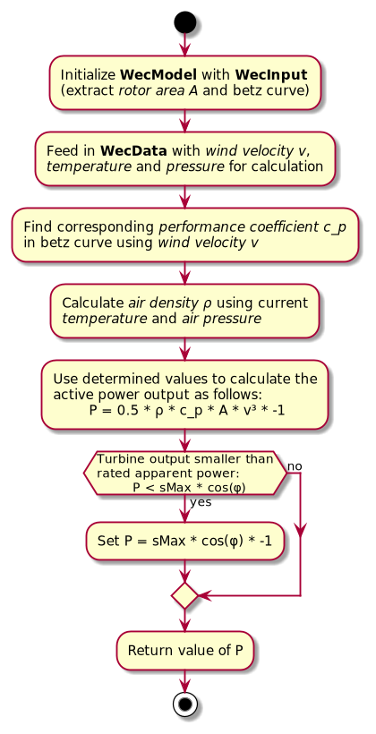
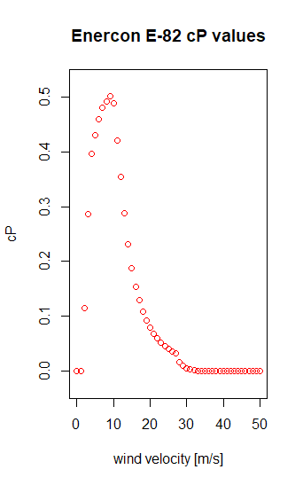

(wec_model)=

## WecModel

This page describes the wind energy converter model (WecModel). Given the current wind velocity, temperature and air pressure the model can calculate the wind turbines active power output.

### Attributes, Units and Remarks

Please refer to {doc}`PowerSystemDataModel - Wec Model <psdm:models/input/participant/wec>` or Attributes and Units used in this Model.

### Calculation

The figure below depicts the calculation steps as implemented.

**Air density**
The air density is calculated using the temperature and the air pressure, as stated in the diagram above. For this calculation the formula $\rho = \frac{(P \cdot M)}{R \cdot T}$ is used. The arguments for this formula are listed in the table below. In case no air pressure is given, the default value $1.2401 \frac{kg}{m^3}$ is returned, which corresponds to the air density at sea level at 20° Celsius.

| Argument | Unit      | Remarks                                  |
| ---------- | ----------- | ------------------------------------------ |
| P        | Pa        | air pressure                             |
| M        | kg/mol    | molar mass of air (0.0289647)            |
| R        | J/(mol*K) | universal gas constant (8.3144626181532) |
| T        | K         | temperature                              |

Note, that the arguments M and R are constants. Their values are contained in the column "Remarks". After inserting the constant values the formula looks as follows: $\rho = \frac{p}{287.058 \cdot T}$

#### Enercon E-82

It is useful to look at a real wind turbine for the visualization of some parameters.

###### Rotor area

The Enercon E-82 has a three-bladed rotor with a diameter of 82m. A rotors swept area is a circle, therefore it is calculated as follows: $A = \pi \cdot r^2$. The swept area (rotorArea) of the Enercon E-82 is $5281.02\:{m^2} = \pi \cdot (\frac{82\:m}{2})^2$.

###### Betz curve

The betz curve (or betz characteristic) is a mapping of wind velocities to cP values. It is used to determine the power that can be extracted from the wind. It follows [Betz's law](https://en.wikipedia.org/wiki/Betz's_law). Each wind turbine has a unique betz curve. The figure below shows the betz curve for the Enercon E-82 wind turbine.

The cut-in wind velocity is $2\frac{m}{s}$, meaning that the turbine requires wind speed of at least $2\frac{m}{s}$ to produce energy. The cut-off wind velocity is $34\frac{m}{s}$, meaning that the Enercon E-82 won't produce energy for velocities that are higher.
