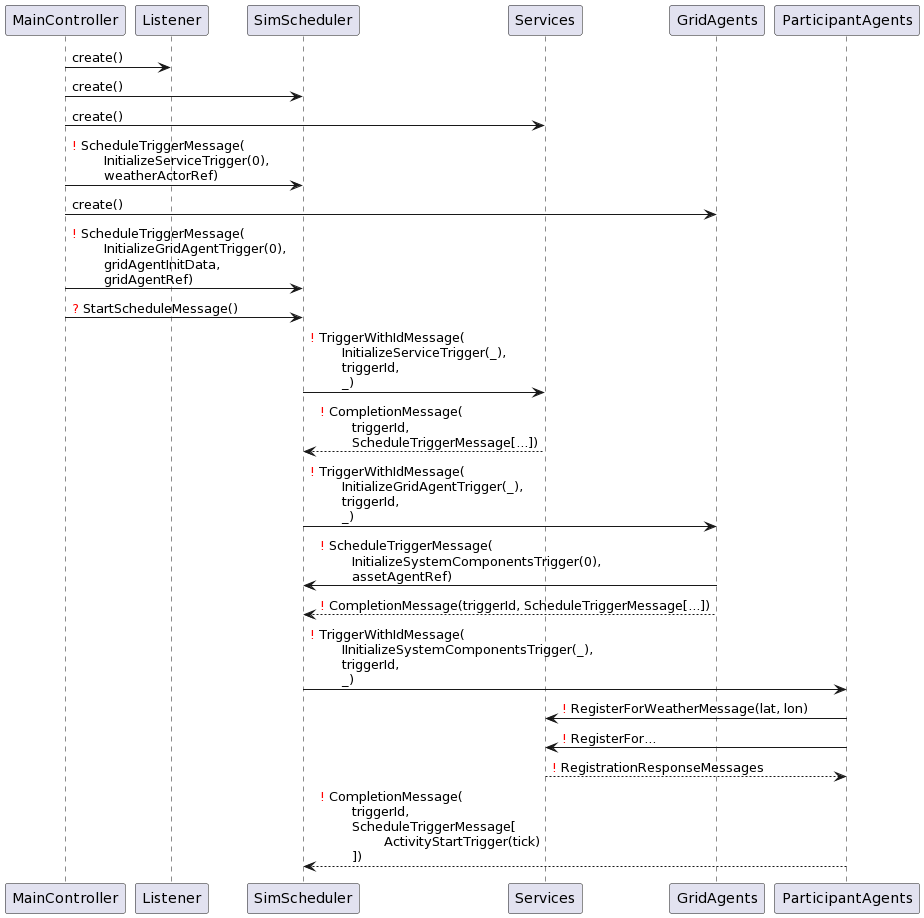
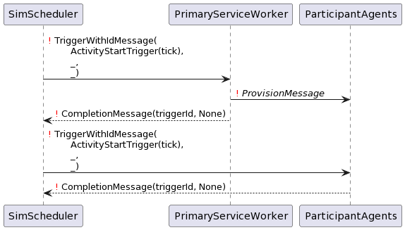
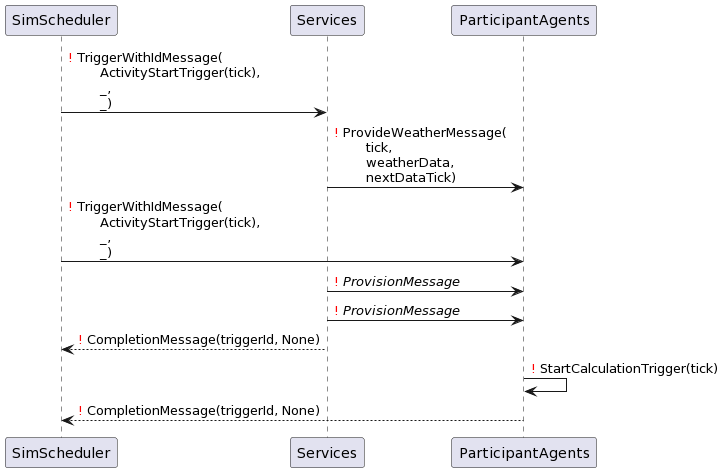
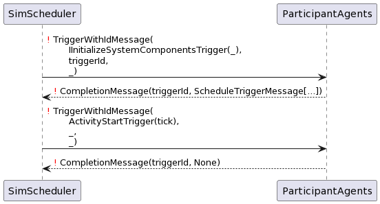

Initialization phase
--------------------

Triggering of participant agents
--------------------------------

Participant triggered by primary data
~~~~~~~~~~~~~~~~~~~~~~~~~~~~~~~~~~~~~

This activation protocol is used, if the agent is foreseen to only play back externally given, precalculated model
results.

Participant triggered by secondary data
~~~~~~~~~~~~~~~~~~~~~~~~~~~~~~~~~~~~~~~

This is the usual activation protocol of a participant agent.
The participant agent asks the scheduler to trigger it (the participant agent) in the same tick in order to achieve
timely synchronization within the ready check window.

Participant triggered by itself
~~~~~~~~~~~~~~~~~~~~~~~~~~~~~~~

This case only occurs, when the participant model itself does not rely on any other data.
This might be the case for a fixed feed in model as well as constant power load models.

