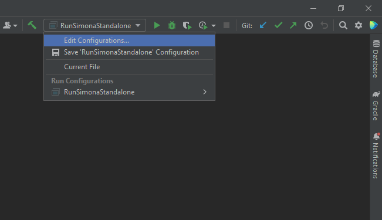

# User's Guide

## Getting Started

The user's guide is here to give you a basic rundown of all the things you need to know to get you up and running. We will give you some information on how to install and setup SIMONA as well as some insights into configuring a simulation run.

## Requirements

To run and customise the project you need to install **Java Development Kit (JDK)**, which you can do directly from IntelliJ IDEA. To do this, press ``ALT + Ctrl + Shift + s`` to open the Project Structure window. Go to ``SDKs``, press on the ``+`` sign in the second column and select ``Download JDK``. Then select version 17 from any vendor and click ``download``. Also, make sure version 17 is selected in the Project tab of the Project Structure window.


Additionally, a **Scala Plugin** is required to work with SIMONA. If it is not already installed, a notification will pop up at the top of the editor, which lets you quickly download one.


Finally, you will also need a **Scala SDK**. Similarly to the Scala Plugin, a notification will let you know if you have not installed one already. To fix this issue, go to ``Setup Scala SDK -> create``, then choose the newest version and download.


## Installation

You can find and download the source code of the latest stable SIMONA version [here](https://github.com/ie3-institute/simona). Go ahead and clone the repository using git:

    $ git clone https://github.com/ie3-institute/simona.git


## Running a Standalone Simulation

Running a standalone simulation is a matter of invoking the ``RunSimonaStandalone`` object. You can find it at ``./src/main/scala/edu/ie3/simona/main``.
As what you are getting from the git repository is scala source code, you need to compile the code before you can run it.
You can either delegate the job to your preferred IDE or build an executable jar manually and use a command line interface (CLI).

### Starting SIMONA using a CLI

In order to be able to execute SIMONA from a CLI, you need an executable fat jar. A fat jar contains all compiled classes and dependencies, ready for execution. For building one, you can use a Gradle task of the project.

1. Open a CLI and change directories to the top level directory of the project.   
2. Execute ``gradlew shadowJar`` within the CLI. This creates a fat jar of SIMONA inside the directory ``build/libs``.   
3. For executing a fat jar you need to specify the classpath of the entrypoint of your application. Assuming we are still in the top level directory of our project, the execution command would look as follows:

    
        java -cp build/libs/simona-2.1-all.jar edu.ie3.simona.main.RunSimonaStandalone 


### Starting SIMONA using an IDE

If you use an integrated development environment (IDE) all you have to do is navigate to the class, and press ``right-click -> run``. The IDE will compile and then execute the code for you.

When executed, the simulation starts at a specified start time and simulates the system interactions until the specified end time.
As you might wonder who tells SIMONA when to start, when to end and what to actually perform a simulation on, there is indeed a piece missing.
Since a simulation can be run with all sorts of grids and with different parameter sets, a simulation configuration has to be set for successful execution.

## Simulation Inputs

### Default Config and Where to Find It

Within the SIMONA repository, there are two default configurations and their corresponding grids with all necessary data to execute a simulation.
For each configuration, there is a separate directory in the project directory at ``./input``.
Sample configurations are provided within the subdirectory ``samples``.
Each configuration is described by a ``.conf`` file that holds the simulation configuration parameters.


### Set the Simulation Configuration

When running a simulation, SIMONA expects the directory of the configuration file as a command-line argument.
Let's pretend you want to start a simulation with the default ``vn_simona`` configuration.

#### Using a CLI

When you want to start a simulation run from the command line interface you have to pass the directory of the config file as a command-line argument. That would look as follows:

    java -cp build/libs/simona-2.1.0-all.jar edu.ie3.simona.main.RunSimonaStandalone --config=input/samples/vn_simona/vn_simona.conf


#### Using IntelliJ IDEA

If you are using IntelliJ IDEA as your IDE, this is how setting the command line argument would look like:

1. Find the ``vn_simona.conf`` file in your project directory and copy its path from the content root

    

2. Go to the window "Select Run/Debug Configuration" and select "Edit Configurations"

    

3. Enter ``--config={path from the content root of config file}``

    > **_NOTE:_**
    For our example that would be ``--config=input/samples/vn_simona/vn_simona.conf``

    

4. Click ``Apply`` on the bottom right


### Configuring your Simulation

If you want to change specific parameters of the simulation, you can create a custom configuration file.
For a detailed description on how to do that and all the various configuration parameters you can adjust, see {doc}`config`.


### Model and Grid Data

Besides a simulation configuration, the specifications of each grid component (e.g. lines, transformers, ...) and system participant (e.g. loads, pv plants, ... ) have to be fed into the simulation.
Within SIMONA, we use the [PowerSystemDataModel (PSDM)](https://github.com/ie3-institute/PowerSystemDataModel) for modeling the system components.
Before the data can be utilized for a simulation run, make sure to convert them to the PSDM.
For more information on the PSDM visit the [docs](https://powersystemdatamodel.readthedocs.io/en/latest/index.html) and for an example of how the converted data looks like you can take a look at an example grid at ``./input/samples/vn_simona/fullGrid``.
The example grids are provided as csv files. You can choose to use a different data source for your own grid.
For more information on supported sources, check out the {ref}`config:input parameters`.
Include your grid and its specification by referencing the folder path, where all the converted grid data is located, within your custom configuration file.


### Weather Data

Besides a configuration and the actual grid and grid participants, SIMONA also expects weather data.
There is an option to use sample weather data, but if you want sensible results, definitely consider supplying suitable data.
Information on the expected data format and different supported sources are given in the input parameters section of the {doc}`config` file.

The following How-To's are available:
```{toctree}
---
maxdepth: 1
---
howto/weatherDataHowToCopernicusERA5
```

## Simulation Outputs

The raw simulation outputs get written according to the settings, specified in the output parameters section of the simulation {doc}`config`.
There are different types of output formats. As for the example configuration, the results will be written as csv files into the specified output folder.
Within the folder you can find the following sub folders:

### configs

The ``configs`` folder will hold the ``.conf`` file, which was used to configure the simulation run.


### rawOutputData

Within the ``rawOutputData`` folder you can find the raw simulation results. For writing the output results, the output models from the [PSDM](https://powersystemdatamodel.readthedocs.io/en/latest/index.html) are used.

> **_NOTE:_**
> SIMONA is a [discrete event simulation](https://en.wikipedia.org/wiki/Discrete-event_simulation), where each event marks a change of system state that occurs at a particular point in time.
> Between two consecutive events, the state is assumed to stay the same.
> Accordingly, data is only written for each of these events.
> That means that, for example, for a fixed load there would be only a single entry for it in its result file, since its state doesn't change throughout the simulation.


## Setting up and running an external simulation

SIMONA is capable of running an external sub-simulation by integration within the same time system (ticks) as SIMONA.
The information flow between SIMONA and the external simulation is partitioned into a control stream (see ``edu.ie3.simona.api.ExtSimAdapter``) and a number of optional data streams.
Currently, only a data stream transporting electric vehicle movement information is implemented (see ``edu.ie3.simona.service.ev.ExtEvDataService``).

An external simulation has to depend on [SimonaAPI](https://github.com/ie3-institute/simonaAPI) and make use of some of its interfaces (see below).
In order to run an external simulation, several requirements have to be fulfilled and a bunch of preparation steps have to be followed.

> **_NOTE:_**
> The external simulation is loaded via class loader. Thus, SIMONA and the external simulation should be built using the same JDK.


### Implementation requirements

**External simulation**

- The external simulation should be implemented in its own project (repository).
- The project should include the *shadowJar* gradle plugin (``id "com.github.johnrengelman.shadow" version "x.y.z"``).
- A class (called *main class* here) needs to extend ``edu.ie3.simona.api.schedule.ExtSimulation`` and thus implement the two methods ``Optional<Long> initialize()`` and ``Optional<Long> doActivity(long tick)``. The method ``initialize`` is called when the external simulation needs to be initialized whereas the method ``doActivity`` is called when time step ``tick`` is triggered. ``initialize`` and ``doActivity`` can return a subsequent new tick that the sub simulation should be activated with next.
- For each data stream, a sub-interface of ``edu.ie3.simona.api.data.ExtDataSimulation`` needs to be implemented, such as ``edu.ie3.simona.api.data.ev.ExtEvSimulation``, and all methods of the interface have to be implemented. The *main class* could be the implementing class here.
- In order for SIMONA to use the external simulation, a class that extends ``edu.ie3.simona.api.ExtLinkInterface`` has to reside inside the project. The class has to implement the corresponding methods by returning the control stream and data stream implementations (could all be the same *main class*).
- When loading the external simulations, SIMONA is looking for the corresponding service files of the class ``edu.ie3.simona.api.ExtLinkInterface``. Therefor every external simulation needs the following service file: ``src/main/resources/META-INF/services/edu.ie3.simona.api.ExtLinkInterface``. The service file needs to contain the relative path to the class that extends ``edu.ie3.simona.api.ExtLinkInterface``.
- A <em>very simple</em> example for an external simulation can be found [here](https://github.com/ie3-institute/ExtSimSample)

**SIMONA**

- For EV simulation: The EVCS that are used by the external simulation have to be loaded by SIMONA from the according input data. EVCS are identified by their UUIDs.


### Preparation

These steps have to be performed each time updates to the external simulation need to be deployed.

- Execute ``gradlew shadowJar`` inside the external simulation project.
- Copy the resulting *jar* (usually placed inside ``<external project>/build/libs``) to ``./input/ext_sim/``.

Now, when a simulation with SIMONA is started (see {ref}`usersguide:running a standalone simulation`), the external simulation is triggered at each tick that it requested.

## Troubleshooting

### My power flow calculation isn't converging - why is that?

When your power flow is not converging it means that the load situation in the grid during the time of the power flow calculation is not physically feasible.

This can have basically one of the following two reasons:

1. There is more load in the grid than it can physically handle.

2. There is more generation in the grid than it can physically handle.


One of the main reasons is a misconfiguration of the grid and its assets.
Assess the power of the load and generation units and check if the values make sense.
Keep in mind the metric prefixes that are assumed for the models, which are listed in the [PSDM docs](https://powersystemdatamodel.readthedocs.io/en/latest/index.html).
If everything seems to be configured correctly it could also be the case that the grid itself is incorrectly configured.
Do a similar sanity check for the grids assets.
